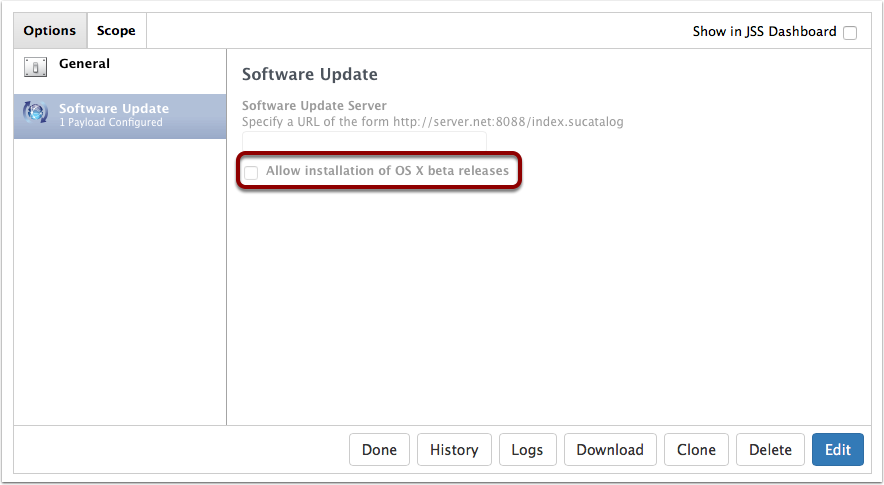
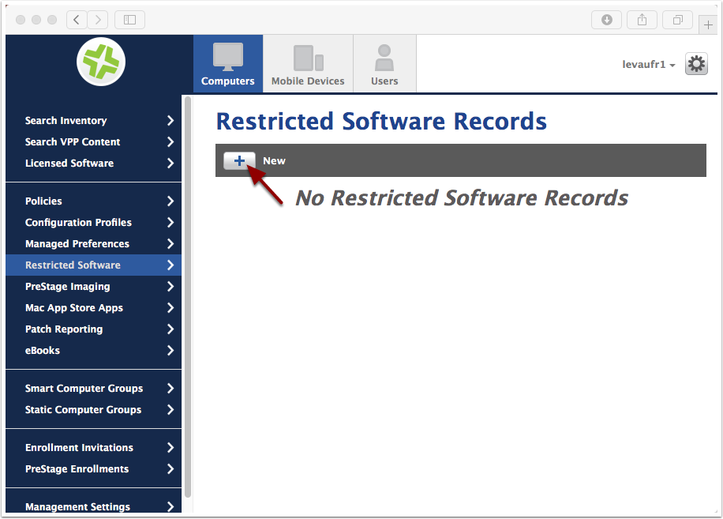
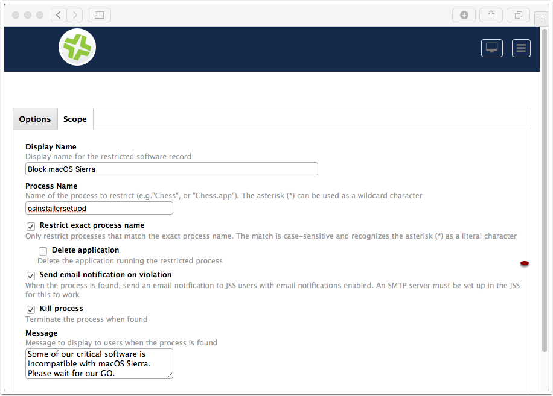
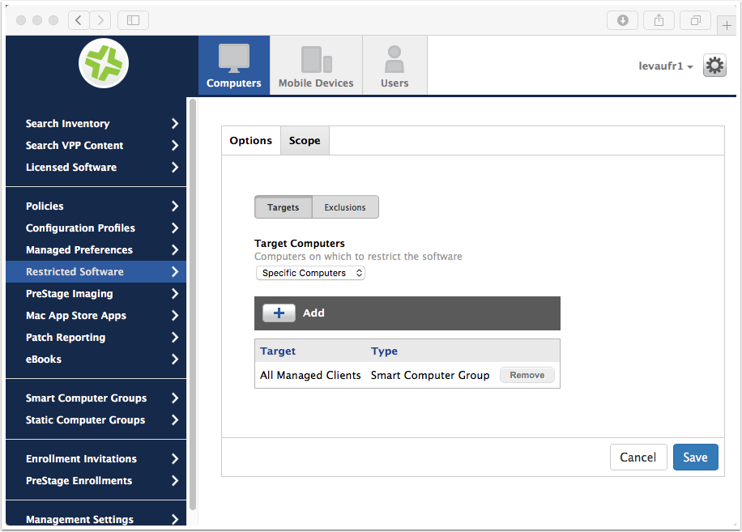
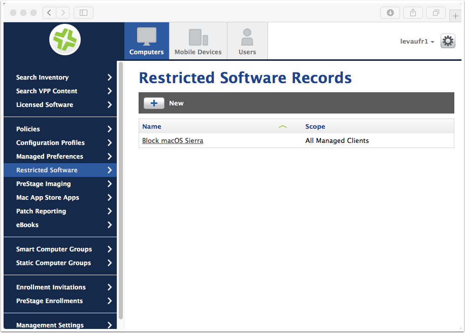
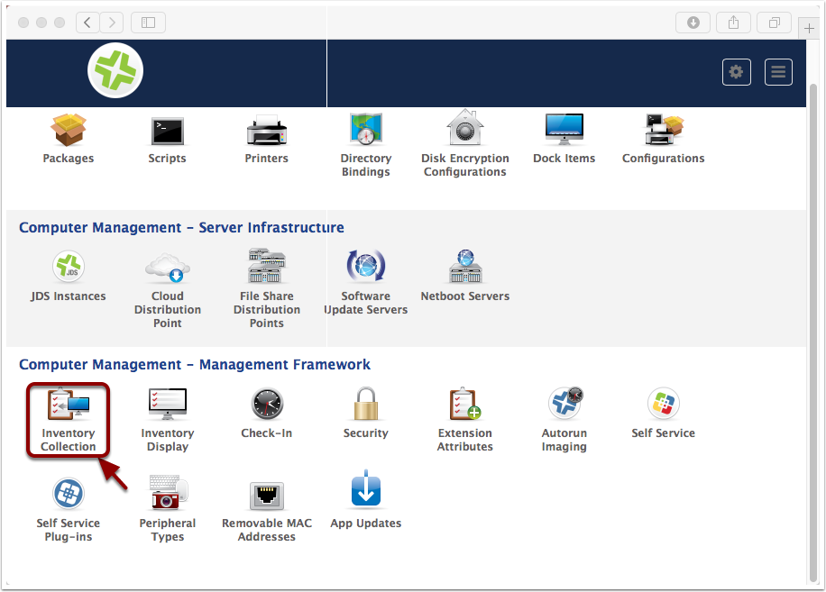
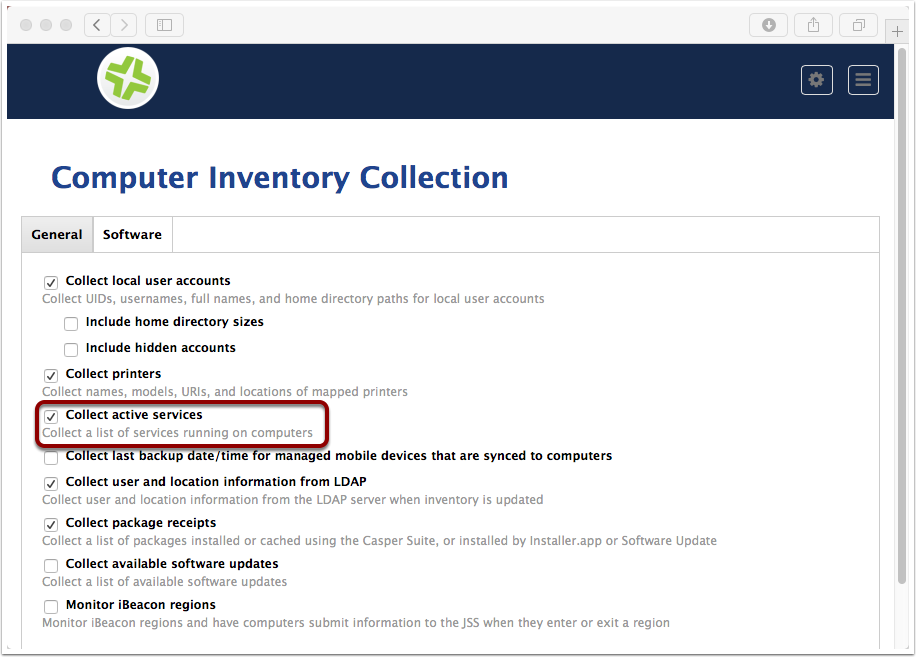
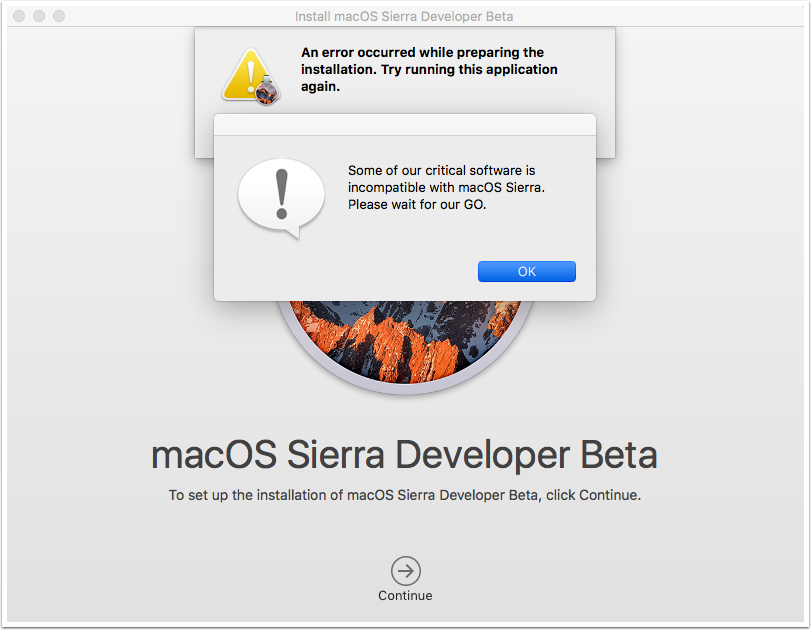

Restrict installation of macOS Sierra
=====================================

Apple has yet to provide a way to prevent the update to a major OS release.
But, I believe it's for the greater good. Everyone should work toward supporting macOS on the day it is released. 
Apple gives us plenty of time to do this, thanks to the Developer, Apple Seed and Public betas.

If something goes wrong and you want to make sure your user don't upgrade to the newest macOS, follow these steps.

Restrict Beta Version
---------------------

If your goal is to restrict the Beta version, Apple provides the following kbase: https://support.apple.com/en-us/HT203018

On Casper Suite, simply create a Configuration profile with a "Software Update" payload and deselect "Allow installation of OS X beta releases".

Restrict Retail Version
-----------------------

As stated above, Apple doesn't provide a way to disable a major OS upgrade.

We'll use JSS built-in "Restricted Software" mechanism to kill the Installation app as soon as it's launched by the user. 

It is not super user-friendly, so make sure you communicate to the users first. 

Restricted Software Records
^^^^^^^^^^^^^^^^^^^^^^^^^^^

#. Open your JSS
#. Go to **Computers > Restricted Software**
#. Click + "New"

Add Restricted Software Record
^^^^^^^^^^^^^^^^^^^^^^^^^^^^^^

macOS Sierra installer uses the process "osinstallersetupd" to setup installation.

Blocking this process will ensure that no user will be able to launch the installation, 
even if renaming "Install macOS Sierra.app".

Scope Restricted Software Record
^^^^^^^^^^^^^^^^^^^^^^^^^^^^^^^^

Choose the right Scope. "All Managed Clients" is usually a good choice. 

I exclude from this Smart Group my test machines and my BYOD clients.

Restricted Software Records
^^^^^^^^^^^^^^^^^^^^^^^^^^^

Our Record is now ready.

Computer Inventory Collection
^^^^^^^^^^^^^^^^^^^^^^^^^^^^^

#. Navigate to **Computers > Management Settings**.
#. Click on "Inventory Collection"

Edit Computer Inventory Collection
^^^^^^^^^^^^^^^^^^^^^^^^^^^^^^^^^^

Check "Collect active services".

.. NOTE:: I couldn't find relevant resources to confirm this was needed, but my tests indicate so

On the client
^^^^^^^^^^^^^

You may want to try a "jamf manage" and a "jamf policy" to refresh the management framework.

If you launch "Install macOS Sierra.app", you'll get the following screen.

